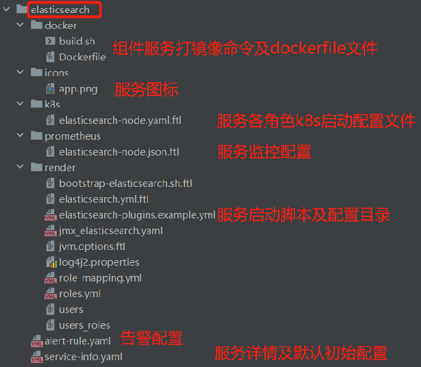
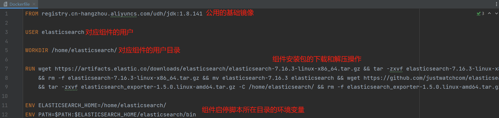
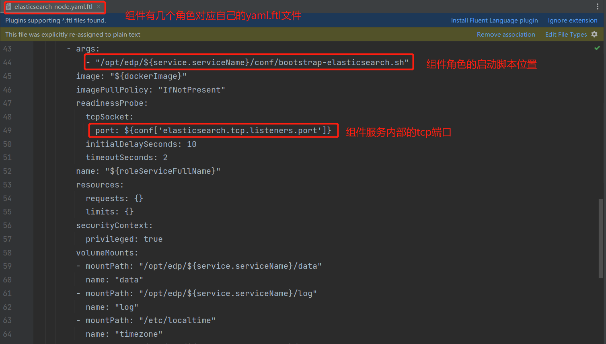
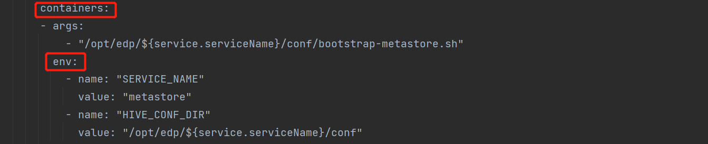
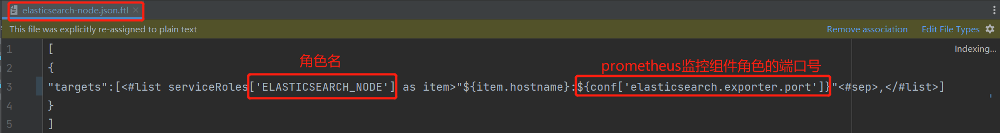
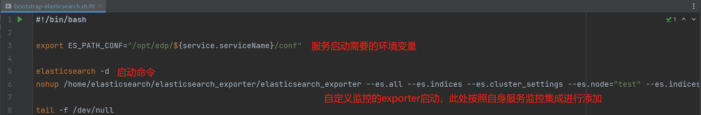
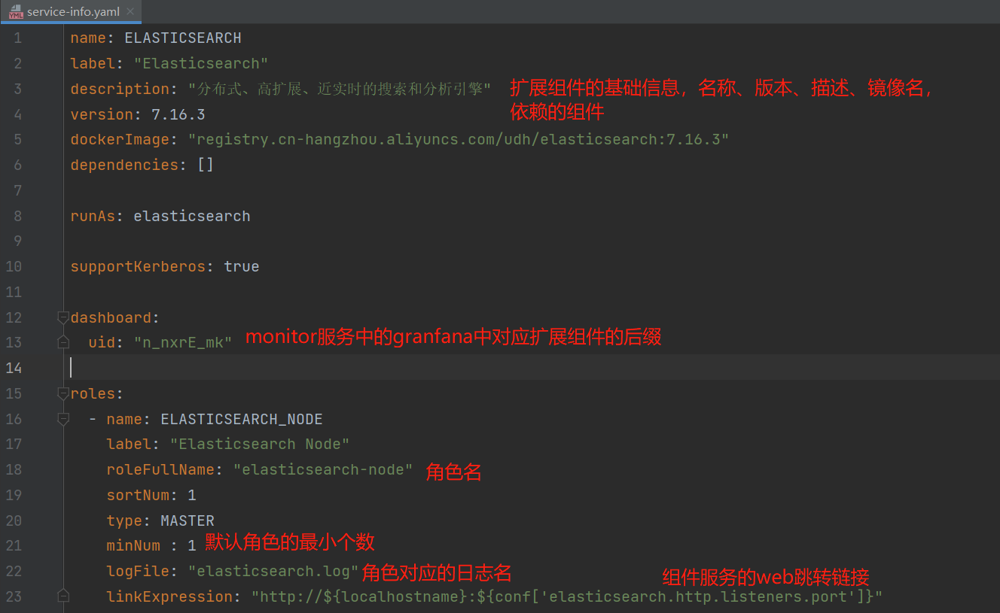
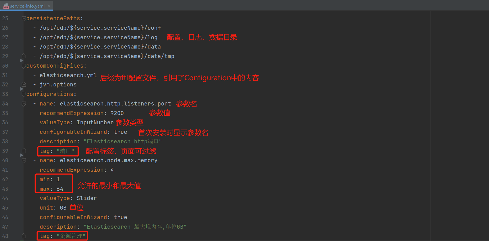

# 组件扩展文档

**本文以elasticsearch为例**

## 流程

### 拉取cloudeon源码

https://github.com/dromara/CloudEon.git

### 新建扩展组件目录内容

```shell
CloudEon\cloudeon-stack\EDP-1.0.0\组件服务名
```

**copy其他组件的目录内容到扩展目录下，并进行对应修改**

### 组件扩展

#### 目录介绍

如下7部分内容


#### docker

```shell
build.sh：打镜像脚本
```


此处推送的远程仓库为cloudeon社区的仓库，没有权限的话可以先推送到你自己的dockerhub或者私有仓库中。
得保证cloudeon启动后能访问得到。
image的全路径名和service-info.yaml中的要保持一致。
```
Dockerfile：镜像内容
```



#### icons

```shell
扩展组件服务图标
```

#### k8s

此处yaml.ftl文件前缀的命名就是组件的角色名，此处角色名是在service-info中的roleFullName，需要一一对应



**注意**：如果服务内部需要配置相关环境变量，添加如下内容（以hive为例）



#### prometheus

此处json.ftl文件前缀的命名就是组件的角色名，此处角色名是在service-info中的roleFullName，需要一一对应



#### render

**此处主要是两部分：bootstrap-组件服务名.sh.ftl、服务conf目录下的文件**

1. bootstrap-组件服务名.sh.ftl

   

2. 服务conf目录下的文件

   ```shell
   后缀带ftl的表示引用了service-info.yml里面的内容
   ```

#### alert-rules

*此处基础规则如下格式，其他规则参照各自服务监控指标名进行添加*

```shell
rules:
  -   alert: ElasticsearchNode进程存活（告警名）
      promql: up{job="elasticsearch"} != 1（指标名不满足某个条件告警）
      alertLevel: exception（告警级别，一般是exception,warnings）
      serviceRoleName: ELASTICSEARCH_NODE（服务角色）
      alertAdvice: ElasticsearchNode宕机，请重新启动（告警解决方式）
      alertInfo: "{{ $labels.job }}的{{ $labels.instance }}实例产生告警"（组件服务的哪个角色实例告警）
```

#### service-info





### 监控集成

1. CloudEon\cloudeon-stack\EDP-1.0.0\monitor\render\prometheus.yml.ftl,增加如下

   ```shell
   - job_name: '组件名'
       metrics_path: '/metrics'（此处按照服务自身的exporter进行补充）
       file_sd_configs:
       - files: ['discovery_configs/服务角色名.json']
   ```

2. CloudEon\cloudeon-stack\EDP-1.0.0\monitor\render\provisioning\grafana，增加如下文件

   ```shell
   组件角色.json（监控页面布局及显示，具体查看grafana使用）
   ```

## 扩展组件安装

1. 扩展组件目录放在cloudeon服务目录的cloudeon-stack\EDP-1.0.0下
2. 重启cloudeon服务
3. 重启monitor服务（此处提前修改monitor服务conf下的prometheus.yml、provisioning\grafana下添加组件角色.json之后）
4. 页面点击安装扩展组件服务

## 编写组件安装文档

1. CloudEon\cloudeon-docs\docs\支持组件\扩展组件OnK8s.md
2. CloudEon\cloudeon-docs\docs\mkdocs.yml中扩展组件说明
