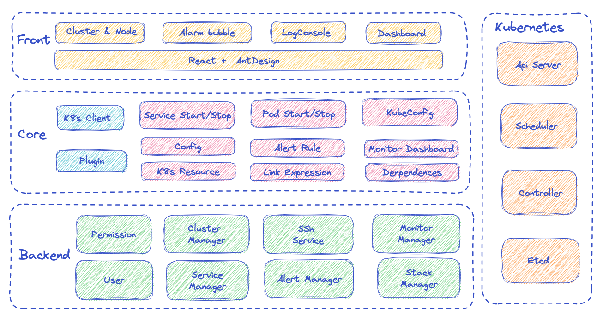
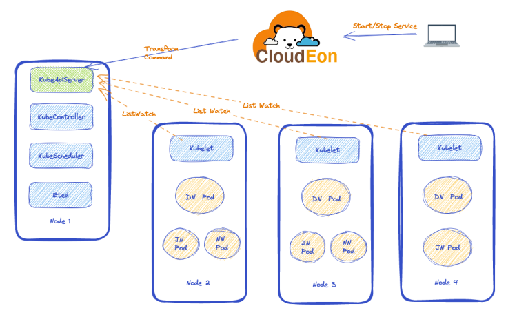

# 项目介绍
## 🚀 什么是CloudEon
CloudEon 将基于 Kubernetes 的资源安装部署开源大数据组件，实现开源大数据平台的容器化运行，您可减少对于底层资源的运维关注。

## 🔍特性

- 快速搭建大数据集群
- 容器化运行大数据服务
- 支持监控告警等功能
- 支持配置修改等功能
- 自动化运维
- 可视化管理界面
- 灵活的扩展性
## 💎功能架构

##  🍓 实现思路

