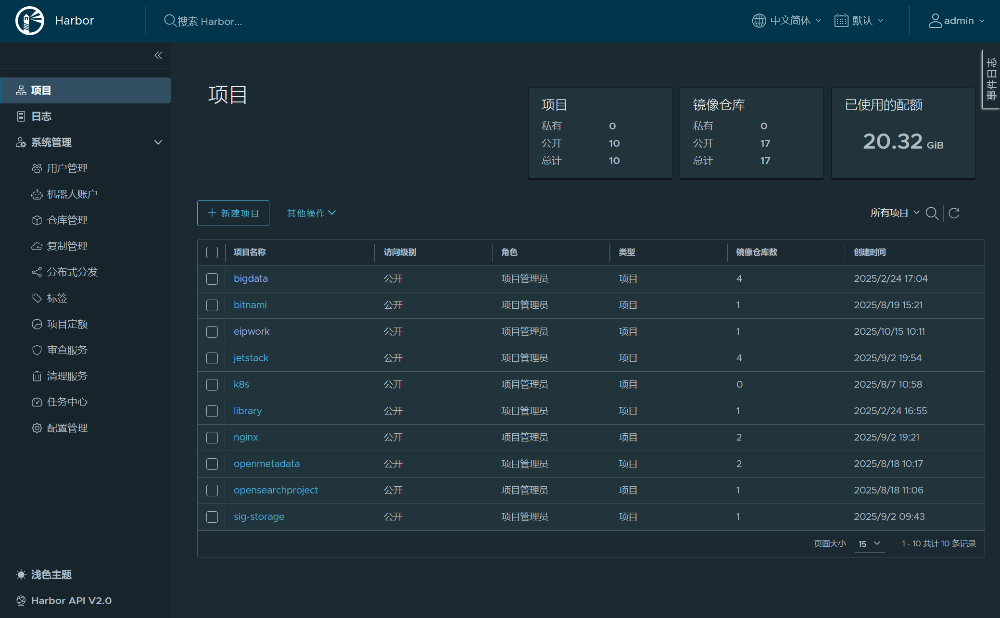
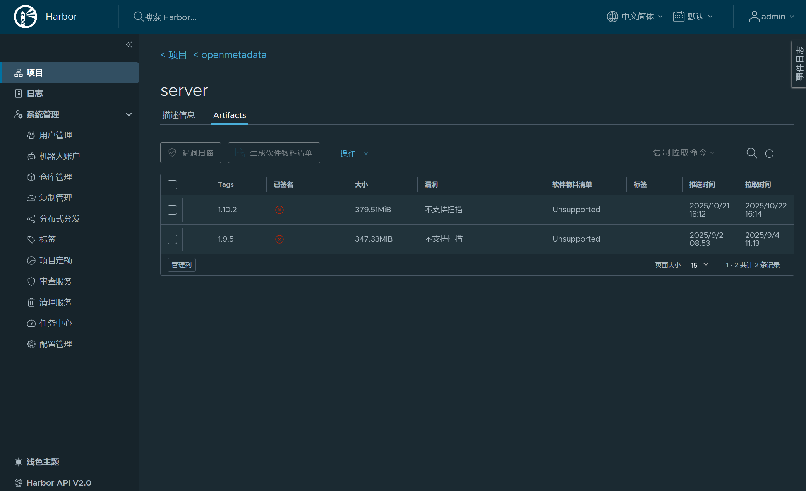

# 部署前提

本文介绍在部署 CloudEon前, 所需要准备的一些先决条件。

## Kubernetes环境（必须）
CloudEon需要一个可访问的Kubernetes集群，目前已知支持的版本是`1.21+` ，如果没有Kubernetes环境可以使用 [kubekey](https://github.com/kubesphere/kubekey) 快速搭建一个。
也支持在k3s上部署。

## HOSTNAME检查（必须）
每个绑定到Kubernetes集群的节点都需要一个唯一的主机名，CloudEon会使用主机名来标识节点，所以必须保证主机名唯一。
而且每个节点的主机名必须能够通过DNS解析，所以必须保证主机名能够被DNS解析。
可以在不同节点上用ping的方式来检查其他节点的主机名是否能够被DNS解析。

## 数据库环境（非必须）

CloudEon默认使用H2作为内置数据库
也支持Mysql作为数据库，可以通过修改 application.yaml 文件进行配置，数据库表会自动创建并完成格式化

## k8s命名空间（必须）

需提前创建k8s命名空间供cloudeon部署组件使用。
参考命令为 `kubectl create ns 命名空间`。
不建议使用default。

## Harbor 私有仓库环境（非必须，但推荐）

CloudEon默认使用 Docker Hub 等公共的容器镜像文件仓库，但有些组件不在这些公共仓库上，或者由于网络原因难以拉取，因此强烈推荐在公司内部环境
搭建 Harbor 私有仓库服务，它提供了一个安全、可信赖的仓库来存储和管理Docker镜像。
这种部署在本地云环境中的私有仓库，可以方便地用于组织内部开发、测试和生产环境中的容器镜像管理，保证数据安全性。尤其是一些大型的组件（如 Doris），
以及自定义组件（如自行编译打包的 Datavines）的部署，非常适用。

