# Dinky on  K8s
安装服务
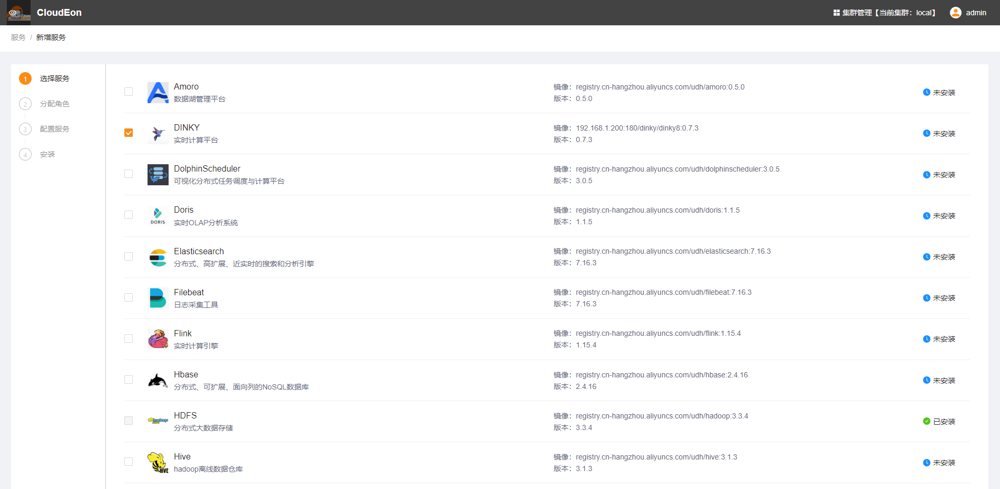
分配角色实例到指定节点安装
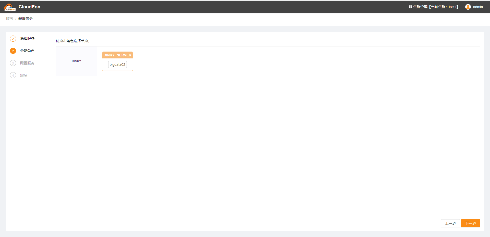
修改初始化配置，需要填写mysql信息，数据库得提前自行准备好

安装成功
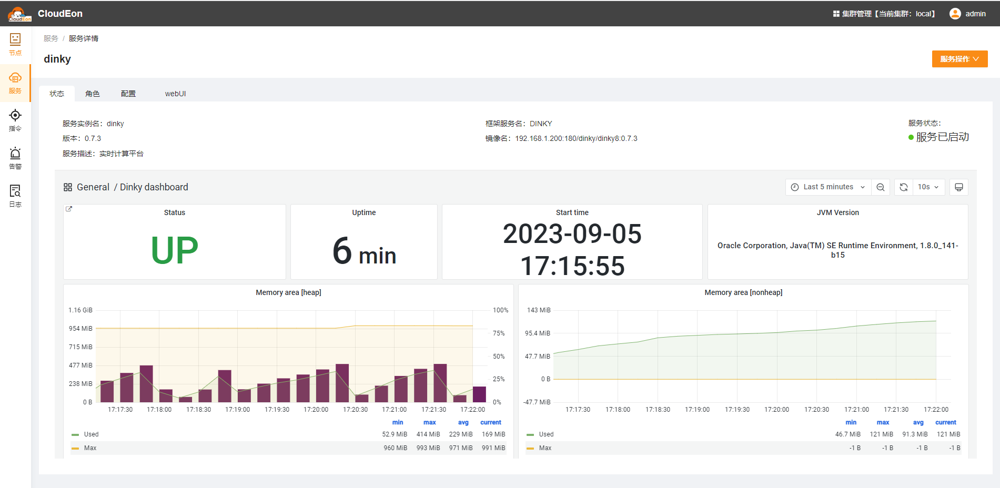
可以用在k8s集群上看到对应的pod
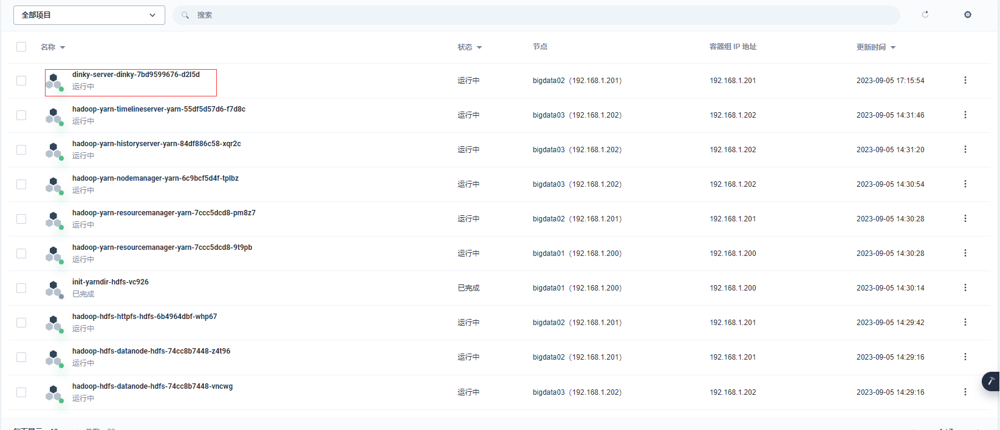
打开web地址，默认密码是admin/admin
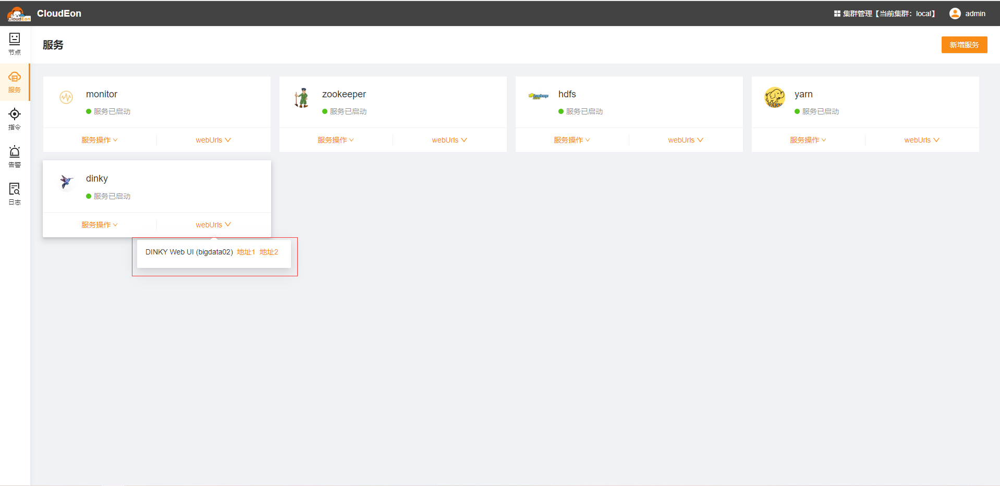
在注册中心，Flink实例管理中创建flink集群地址
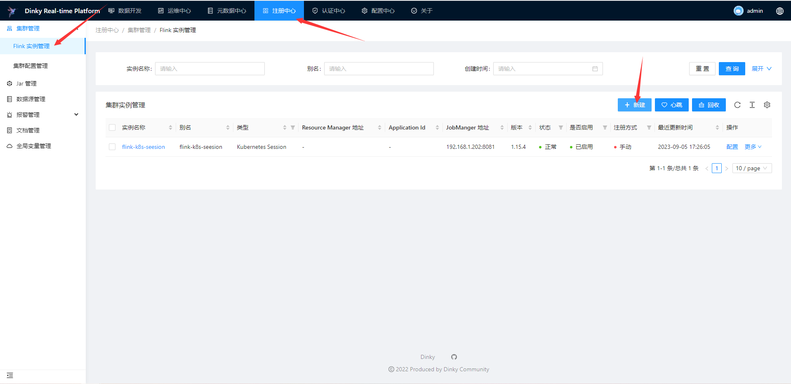
在数据开发中创建目录，创建作业
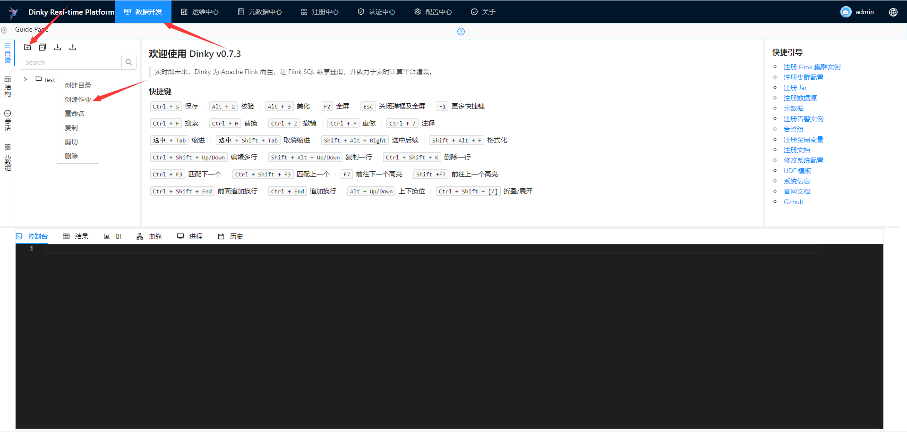
完成代码开发并在右侧选择执行模式，Flink集群,FlinkSQL环境并对任务进行保存并进行代码检查
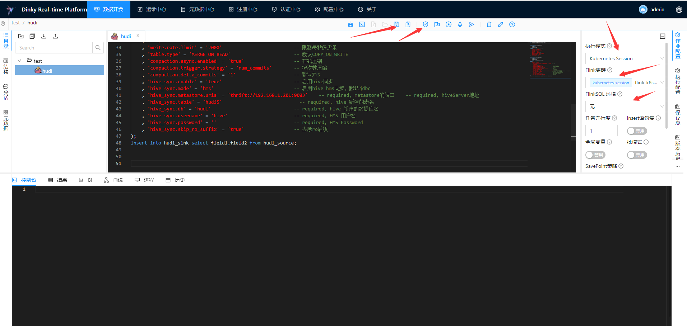
检查通过说明dinky与相关组件集成成功，目前dinky与hudi、kafka、hive、mysql-cdc、jdbc、es集成成功
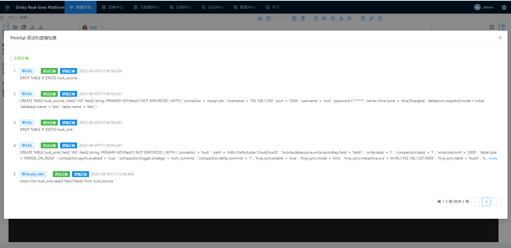
选择向flink提交任务
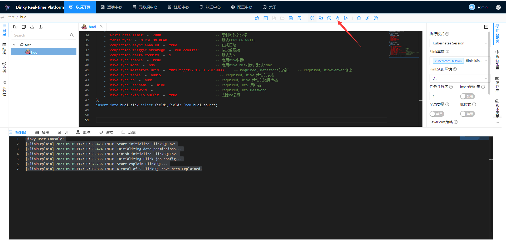
可以看到flink作业已经正常在flink集群上启动
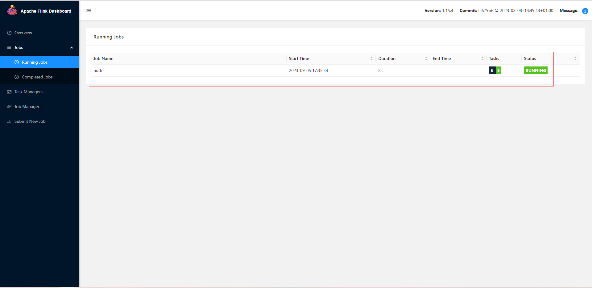

Dinky支持Flink Yarn Application模式

在注册中心的集群管理中使用集群配置管理功能创建flink集群
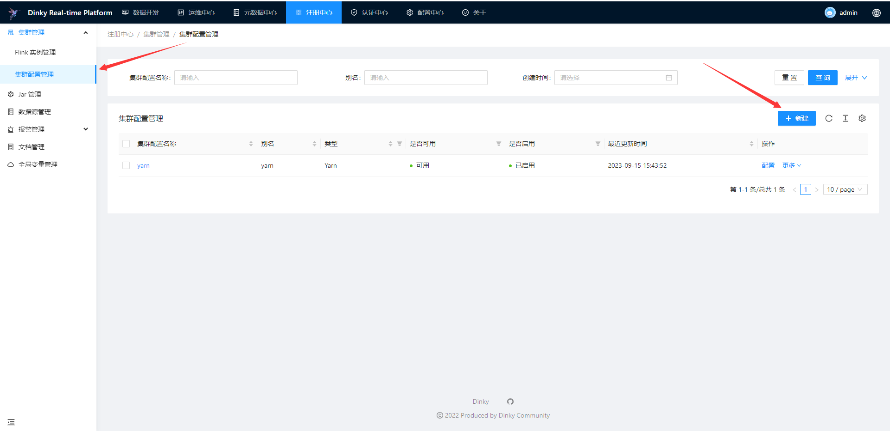
注意:
Hadoop 配置文件路径:/opt/edp/dinky/conf/  (固定) 
Flink 配置文件路径:/opt/flink-1.15.4/conf (固定) 
lib 路径:hdfs:///flink/lib    (默认，可自定义，但是需要将Flink的lib目录下的jar上传至自定义的hdfs目录) 
如需上传至自定义目录可进入dinky容器执行以下命令: 
hdfs dfs -put $FLINK_HOME/lib/*.jar  newpath
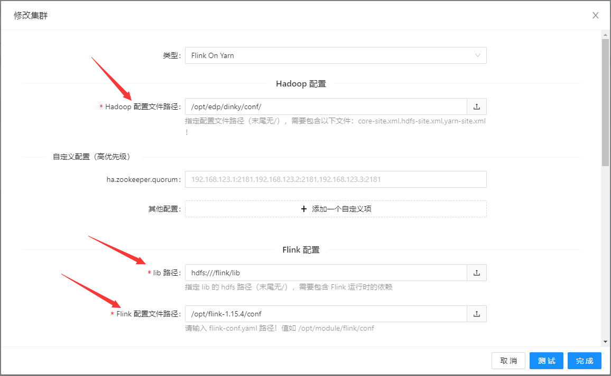
