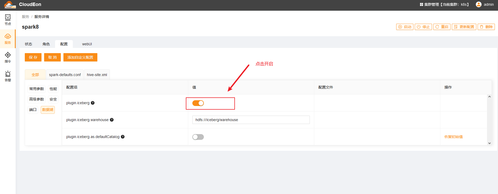
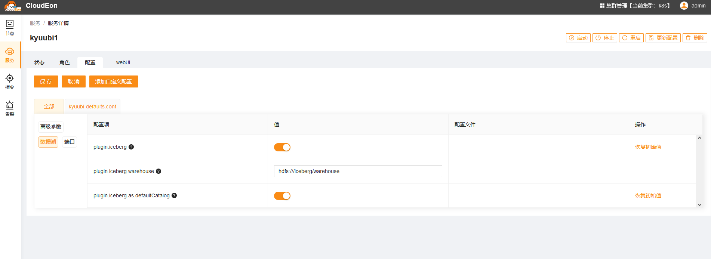
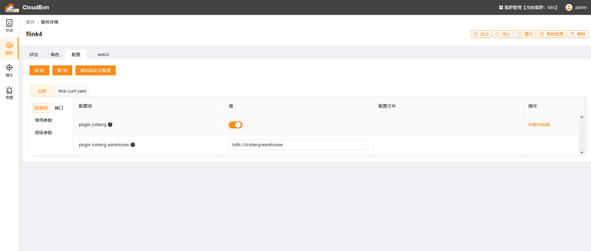

# Iceberg on  K8s
## 介绍
iceberg是以插件模式集成到各个服务中，目前以支持spark、kyuubi、flink

## spark开启iceberg支持
待spark服务安装成功后，在配置页面打开iceberg插件




## kyuubi开启iceberg支持
待kyuubi服务安装成功后，在配置页面打开iceberg插件



## flink开启iceberg支持
待flink服务安装成功后，在配置页面打开iceberg插件



使用kubectl进入pod中。启动standalone集群。


启动成功后，启动sql-client。
```shell
sql-client.sh
```
打开后，输入脚本测试。
```sql
CREATE CATALOG iceberg_catalog WITH (
  'type'='iceberg',
  'catalog-type'='hadoop',
  'clients'='5',
  'property-version'='1',
  'warehouse'='hdfs://hdfscluster1/iceberg/warehouse'
);

CREATE TABLE datagen_v1 (
 f_sequence INT,
 f_random INT,
 f_random_str STRING
) WITH (
 'connector' = 'datagen',
 'rows-per-second'='5',
 'fields.f_sequence.kind'='sequence',
 'fields.f_sequence.start'='1',
 'fields.f_sequence.end'='1000',
 'fields.f_random.min'='1',
 'fields.f_random.max'='1000',
 'fields.f_random_str.length'='10'
);


CREATE TABLE `iceberg_catalog`.`default`.`taxi` (
    f_sequence BIGINT COMMENT 'unique id',
    f_random BIGINT,
    f_random_str STRING
);

SET execution.checkpointing.interval = '30s';

insert into `iceberg_catalog`.`default`.`taxi`  select * from datagen_v1;

```