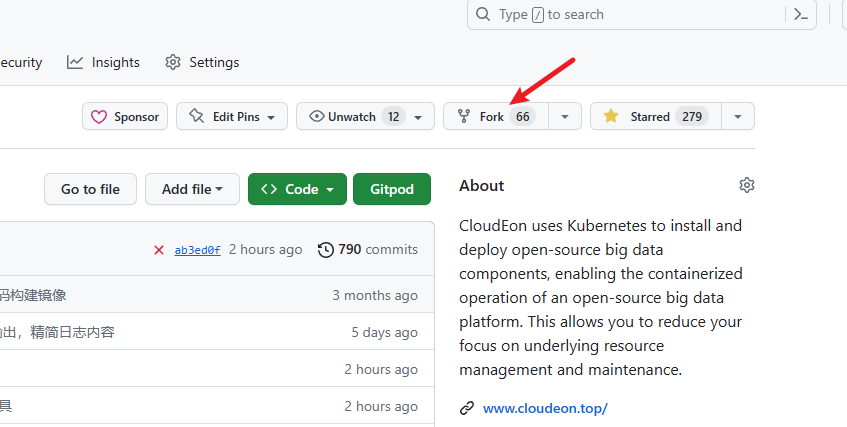
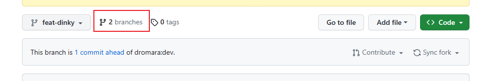
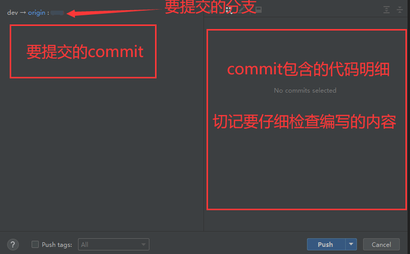
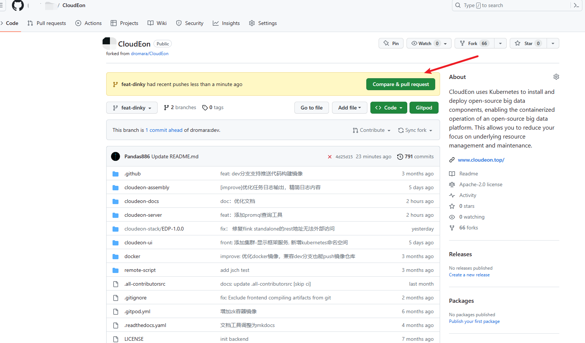
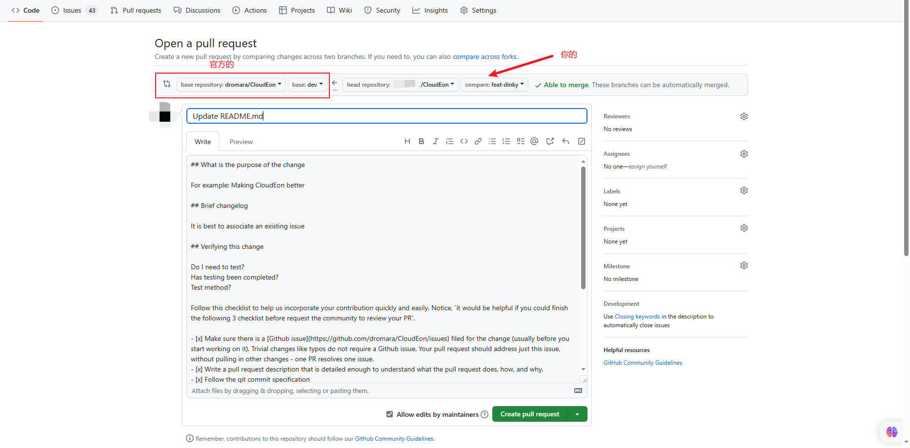

# 贡献指南


我们欢迎每一位贡献者的加入！
## 贡献方式

在 Cloudeon 社区，贡献方式有很多：

代码：可以帮助社区完成一些任务、编写新的feature或者是修复一些bug；

测试：可以来参与测试代码的编写，包括了单元测试、集成测试、e2e测试；

文档：可以编写或完善文档，来帮助用户更好地了解和使用 Cloudeon；

博客：可以撰写 Cloudeon 的相关文章，来帮助社区更好地推广；

讨论：可以参与 Cloudeon 新的feature的讨论，将您的想法跟 Cloudeon 融合；

布道：可以帮助宣传或推广 Cloudeon 社区，在 meetup 或 summit 中演讲；

建议：也可以对项目或者社区提出一些建议，促进社区的良性发展；
****

即便是小到错别字的修正，或者是对404链接的修正，我们也都非常欢迎 😋

## 让 Cloudeon 运行起来

让 Cloudeon 的代码在您的开发工具上运行起来，请参阅 开发指南，并且能够断点调试。

## 寻找任务

寻找您感兴趣的[Issue](https://github.com/dromara/CloudEon/issues) ！在我们的GitHub仓库和邮件列表中，我们经常会发布一些带有` good first issue `或者` status: volunteer wanted` 标签的issue，这些issue都欢迎贡献者的帮助。其中`good first issue`往往门槛较低、适合新手，您可以点击 链接 查看这些issue。

当然，如果您有好的想法，也可以直接在 issue 中提出，经过充分讨论后就可以开始行动。


## 第一次提交 Pull Request

如果您是第一次提交 Pr，首先您需要 Fork 目标仓库。（如果已经 Fork 则不需要再 Fork）



在你的仓库里，创建新的功能分支


然后 用git命令 将代码下载到本地：
```

git clone git@github.com:${YOUR_USERNAME}/CloudEon.git #推荐使用# 
```
也可以 
```
git clone https://github.com/${YOUR_USERNAME}/CloudEon.git
```

下载完成后，请参考目标仓库的入门指南或者 README 文件对项目进行初始化。

接着使用Idea打开项目，切换到你刚才新建的功能分支


完成代码开发后，进行提交



创建PR申请(此操作在自己仓库)

请注意 PR 的标题需要符合我们的规范，并且在 PR 中写上必要的说明，来方便 Committer 和其他贡献者进行代码审查。


