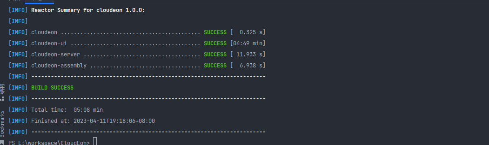
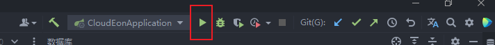
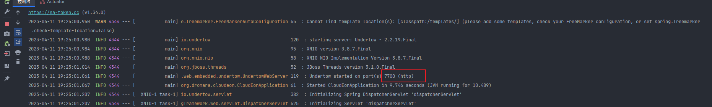

# 开发指南

## 后端开发
拉取代码到本地后，根目录下执行`mvn clean install -DskipTests`，该指令会同时build前端项目成静态文件，因此会慢一点。
等待几分钟后，可以看到构建成功。


然后打开IDEA，修改`src/main/resources/application.properties`文件中的`cloudeon properties`相关的路径指向工程根目录即可。
默认是用H2数据库的，如果需要用Mysql，可以修改如下内容
```properties
spring.datasource.driver-class-name=com.mysql.cj.jdbc.Driver
spring.datasource.url=jdbc:mysql://xxxxx:3306/cloudeon?useUnicode=true&characterEncoding=UTF-8&serverTimezone=Asia/Shanghai
spring.datasource.username=root
spring.datasource.password=root
```
改为后，可以点击

看到控制台如下内容，即启动成功。

此时打开浏览器访问`http://localhost:7700/#/user/login` ，即可看到

