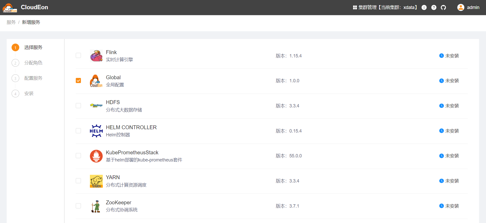
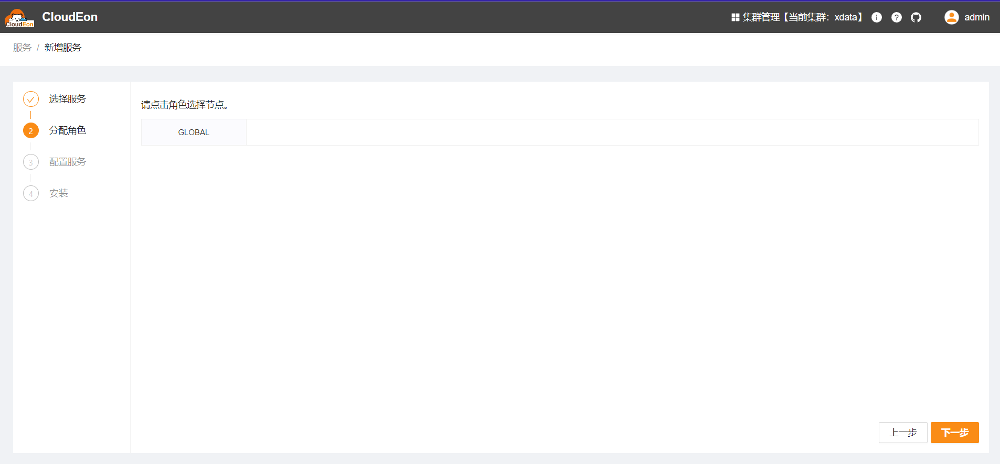
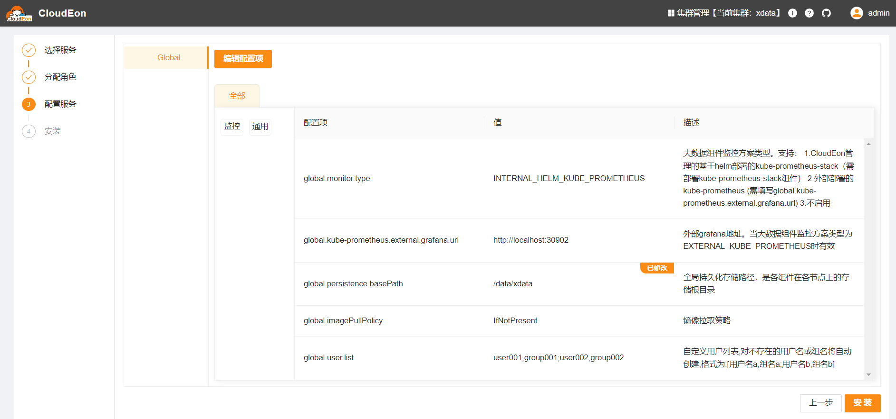
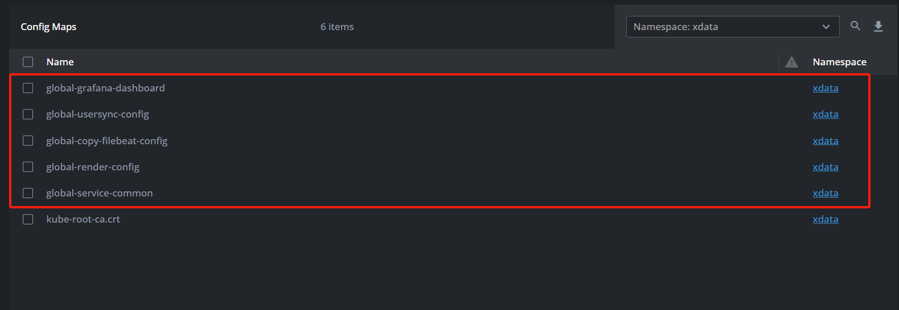

# Global

## 组件说明

CloudEon全局配置组件，此组件的配置会影响其他组件，是所有其他组件的基础。
此组件只是提供配置项，不会进行实际部署。

## 安装步骤

### 选择服务

### 分配角色实例

由于此组件无实际部署动作，故无需且不能选择实例

### 修改初始化配置

【监控方案】根据实际需求选择，【全局持久化存储路径】建议修改，其他一般不用调整

### 检测验证

等待安装成功，可以看到目标命名空间下已产生对应configmap

