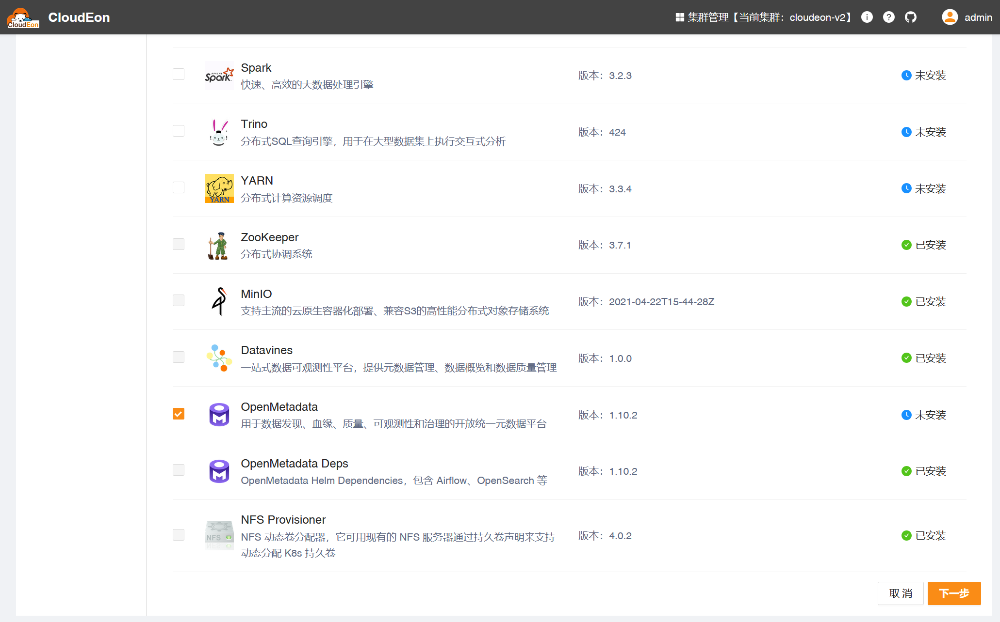
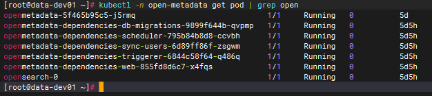
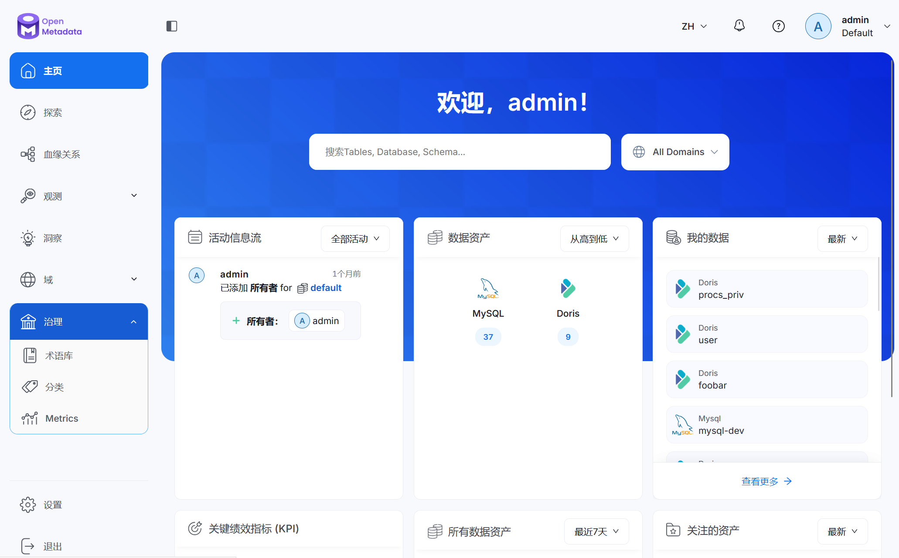

# OpenMetadata

## 组件说明

用于数据发现、血缘、质量、可观测性和治理的开放统一元数据平台。

## 安装步骤

### 选择服务

>本组件依赖 NFS 服务、OpenMetadata Dependencies，请先达到部署该组件的前置要求：
>1. 至少 4G 内存的 K8s 集群；
>2. K8s 集群必须支持现有已配置的 NFS server；（即在当前 K8s 集群各节点部署好 NFS server）
>3. 在 CloudEon 页面上操作部署好 NFS Provisioner 组件；
>4. 在 CloudEon 页面上操作部署好 OpenMetadata Deps 组件，该组件包含 Airflow、OpenSearch 等，还有一些初始化操作，因此耗时稍长，请持续关注 K8s 集群当前组件所在命名空间的容器组部署进度及状态。

### 分配角色实例

1. HelmChart是真正的部署类型，有且只能有1个节点，选择任意节点即可，不影响实际部署。

2. Airflow、OpenSearch 是由HelmChart部署的（MySQL 使用外部已有的实例），这里选择节点只是为了在CloudEon生成访问链接而已，不影响实际部署。至少选择一个节点。

### 修改初始化配置

一般不用调整

### 检测验证

等待安装成功，可以看到目标命名空间下已产生对应pod

对应的服务详情页如下

#### **TODO 监控图表待实现...**

对应的组件运行界面如下

