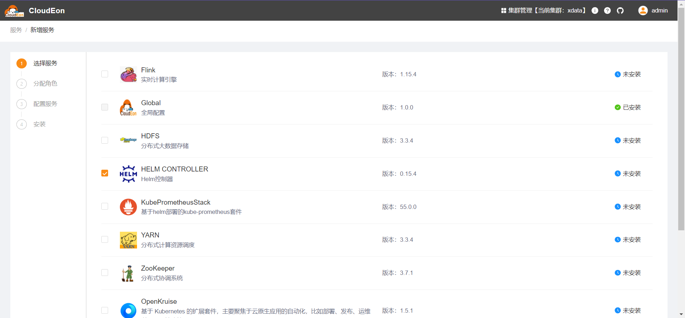
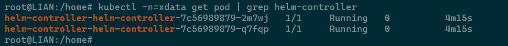

# HelmController

## 组件说明

Helm控制器，带来CloudEon对于HelmChart资源的支持。参考 https://github.com/k3s-io/helm-controller 。

## 安装步骤

### 选择服务

### 分配角色实例

HELM_CONTROLLER 需至少1个节点

### 修改初始化配置

一般不用调整

### 检测验证

等待安装成功，可以看到目标命名空间下已产生对应pod

