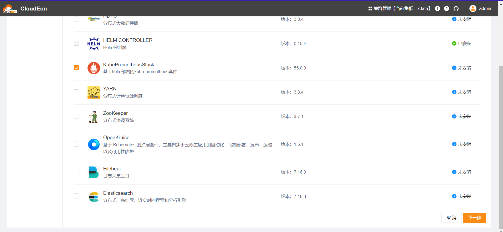
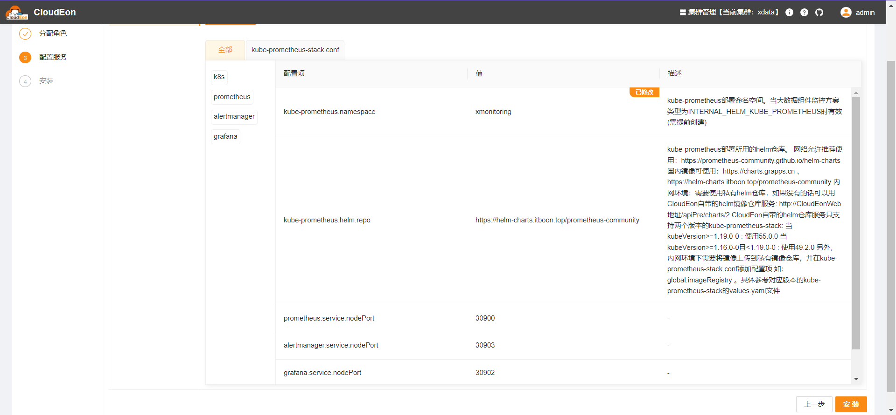

# KubePrometheus

## 组件说明

kube-prometheus套件，含Prometheus、Grafana、AlertManager等组件，是CloudEon指标采集、监控告警等功能的基础，也可对接外部已有的kube-prometheus来取代部署此组件。

参考
https:
//github.com/prometheus-community/helm-charts/tree/main/charts/kube-prometheus-stack 。

## 如何对接外部kube-prometheus

因为CloudEon的监控、告警功能依托Kube-Prometheus的k8s用户自定义资源实现，不需要和Prometheus、Grafana、AlertManager服务器有直接接触（当然，Grafana面板的展示调用除外）。所以，只要外部的KubePrometheus配置了合适的抓取规则和回调参数，便可实现对接。

KubePrometheus所需的配置主要参考此组件的HelmChart资源文件的valuesContent部分

## 安装步骤

### 选择服务

### 分配角色实例

1. HelmChart是真正的部署类型，有且只能有1个节点，选择任意节点即可，不影响实际部署。

2. Prometheus、Grafana、AlertManager是由HelmChart部署的，这里选择节点只是为了在CloudEon生成访问链接而已，不影响实际部署。至少选择一个节点。

### 修改初始化配置

grafana.adminPassword建议修改，其他一般不用调整
需注意命名空间需提前创建

### 检测验证

等待安装成功，可以看到目标命名空间下已产生对应pod

