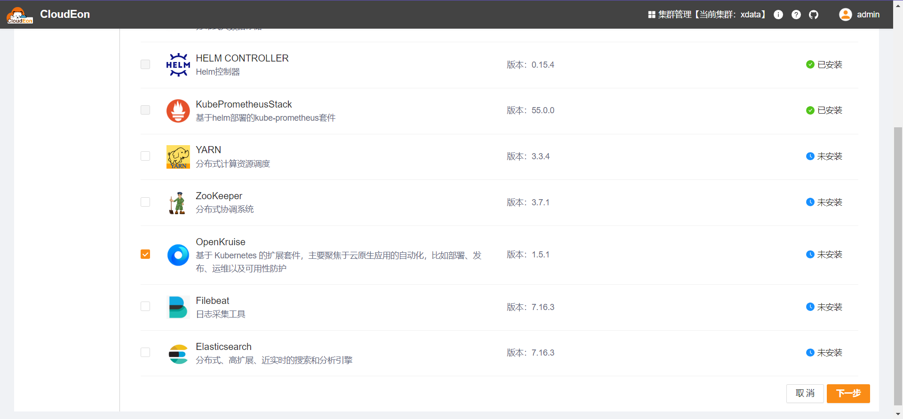
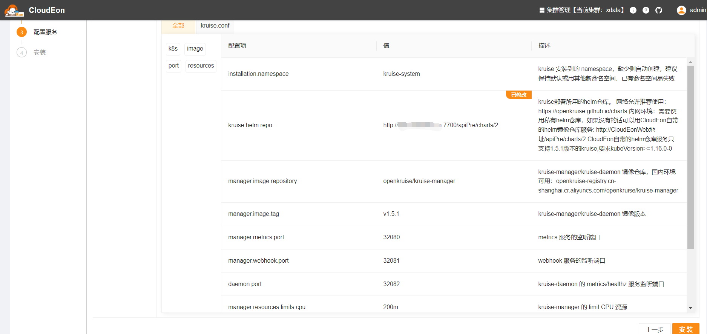
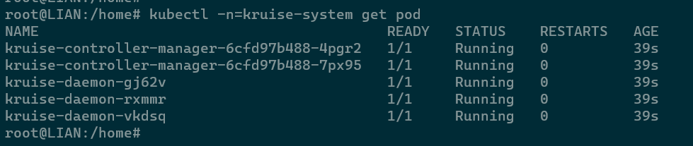

# OpenKruise

## 组件说明

Kubernetes扩展套件，带来CloudEon对于SidecarSet资源的支持，参考 https://github.com/openkruise/kruise 。

## 安装步骤

### 选择服务

### 分配角色实例

HelmChart是真正的部署类型，有且只能有1个节点，选择任意节点即可，不影响实际部署。

### 修改初始化配置

如果节点连接github有问题，则kruise.helm.repo建议修改

其他一般不用调整

### 检测验证

等待安装成功，可以看到目标命名空间下已产生对应pod

