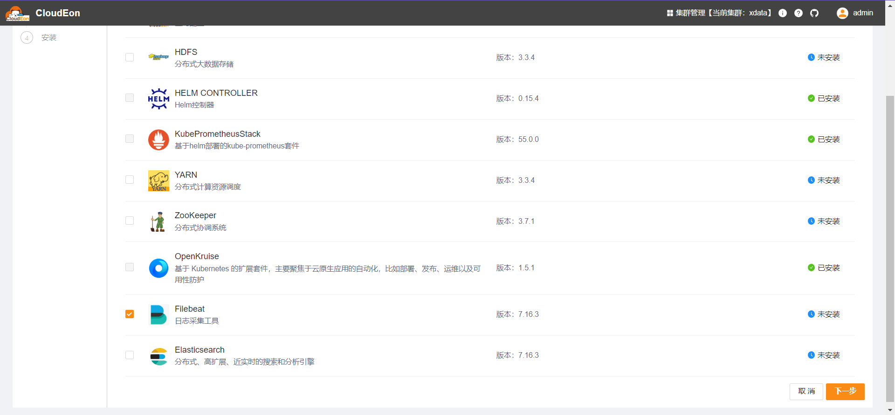
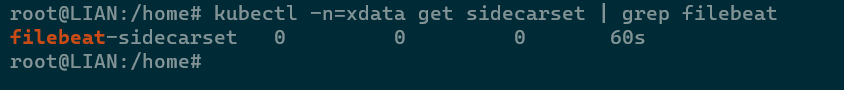

# Filebeat

## 组件说明

日志采集工具，是CloudEon组件日志分析功能的基础，基于Kruise自定义资源实现部署。部署此组件本身不产生新容器，而是在k8s中添加了SidecarSet类型资源。后面在新建/重启pod时，会根据其标签判断是否需要注入filebeat容器。

参考 https://filebeat.io/zh/docs/best-practices/log-container-sidecarset 。

## 安装步骤

### 选择服务

### 分配角色实例

Filebeat的部署类型是SidecarSet，有且只能有1个节点，选择任意节点即可，不影响实际部署。

### 修改初始化配置

一般不用调整

### 检测验证

等待安装成功，可以看到目标命名空间下已产生对应pod

