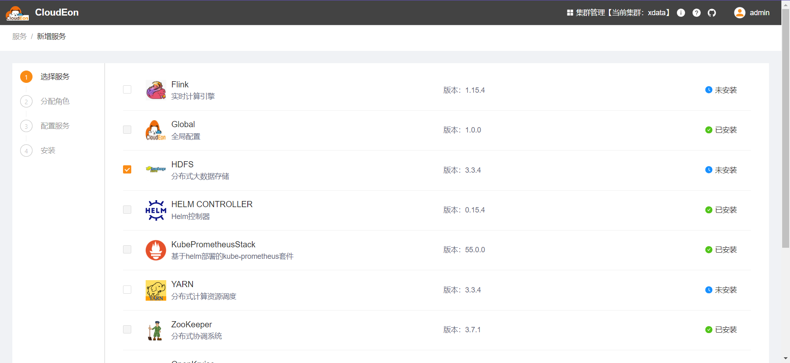
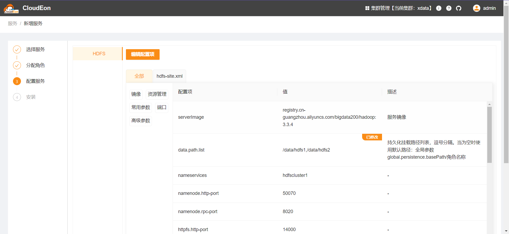
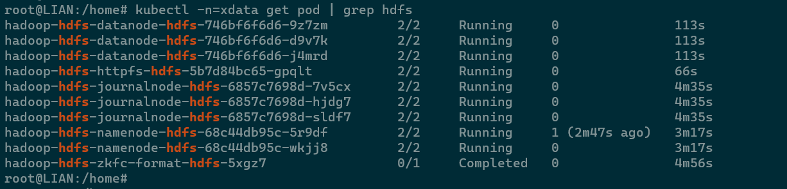
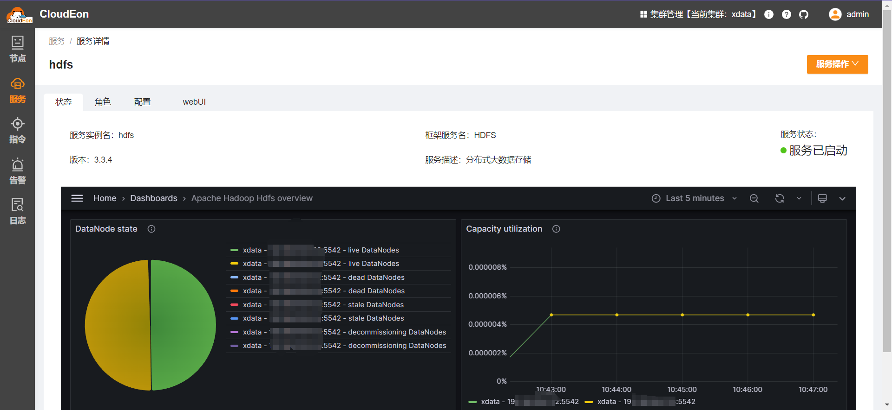

# Hdfs

## 组件说明

分布式高可靠性文件系统

## 安装步骤

### 选择服务



### 分配角色实例

| 角色名              | 节点分配规则                          | 其他                         |
|------------------|---------------------------------|----------------------------|
| HDFS_ZKFC_FORMAT | 有且只能有一个节点，且应在HDFS_NAMENODE所在节点上 | JOB类型资源，执行hdfs的hdfs数据格式化任务 |
| HDFS_JOURNALNODE |                                 | 最少需3个节点，节点数需为奇数            |
| HDFS_NAMENODE    | 固定为2个节点                         | 即一主一从，后续可能改为支持多从           |
| HDFS_DATANODE    | 至少需3个节点                         |                            |
| HDFS_HTTPFS      | 至少需1个节点                         |                            |

### 修改初始化配置

data.path.list和cpu、内存等建议根据实际需求修改，其他一般不用调整



### 检测验证

等待安装成功，可以看到目标命名空间下已产生对应pod

注意：namenode从节点第一次运行可能会报错重启，这是因为主节点还没有初始化完毕：ERROR ha.BootstrapStandby: Unable to fetch
namespace information from any remote NN


对应的服务详情页如下


可以进入任意datanode容器，执行以下命令做功能验证。
命令可以从`cat /opt/service-common/bootstrap.sh`的输出获取

```shell
hadoop fs -ls /
hadoop fs -mkdir /tmp
hadoop fs -put -f $HADOOP_HOME/README.txt /tmp
hadoop fs -cat /tmp/README.txt
hadoop fs -rm /tmp/README.txt

```