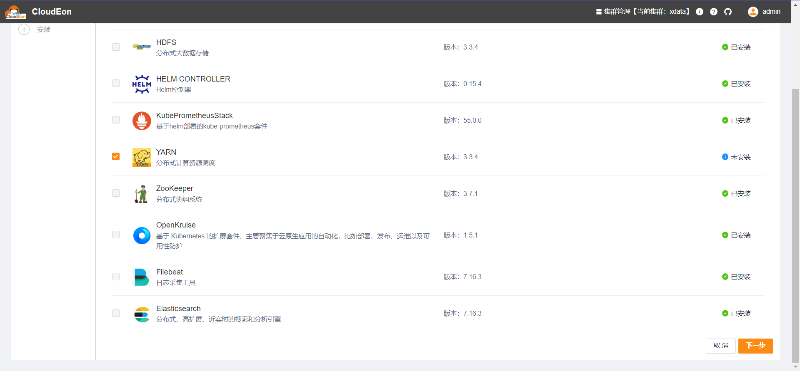
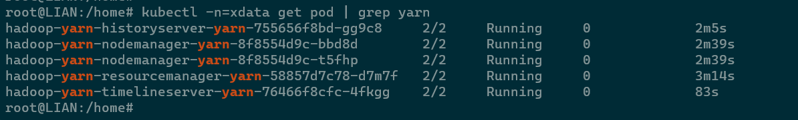
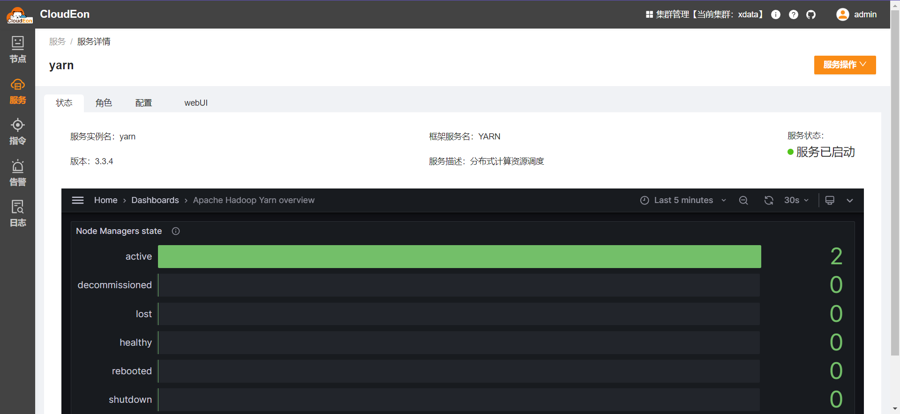

# Yarn

## 组件说明

集群资源管理与调度平台

## 安装步骤

### 选择服务



### 分配角色实例

| 角色名                  | 节点分配规则  | 其他 |
|----------------------|---------|----|
| YARN_RESOURCEMANAGER | 最少需1个节点 |    |
| YARN_NODEMANAGER     | 最少需1个节点 |    |
| YARN_HISTORYSERVER   | 至少需1个节点 |    |
| YARN_TIMELINESERVER  | 至少需1个节点 |    |

### 修改初始化配置

cpu、内存等建议根据实际需求修改，其他一般不用调整

### 检测验证

等待安装成功，可以看到目标命名空间下已产生对应pod

对应的服务详情页如下

可以进入任意nodemanager容器，执行以下命令做功能验证。
命令可以从`cat /opt/service-common/bootstrap.sh`的输出获取

```shell
yarn jar $HADOOP_HOME/share/hadoop/mapreduce/hadoop-mapreduce-examples-*.jar  pi 16 10000

```